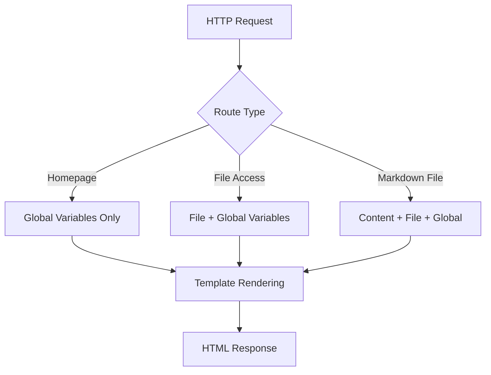

# Template Variables Investigation - Complete Results

## Investigation Summary

This document presents the **complete investigation results** of all template variables available in the transfer.sh web frontend, based on:

1. ✅ **Source code analysis** - All `.html` templates examined
2. ✅ **Documentation review** - `WEBAPP_MECHANICS.md` analyzed  
3. ✅ **Built template inspection** - Compiled templates in `dist/` checked
4. ✅ **Transfer.sh API documentation** - Official README reviewed
5. ✅ **Pattern matching** - All `{{.Variable}}` usage identified

## Complete Variable Inventory

### Discovered Variables (15 total)

| # | Variable | Type | Scope | Source | Usage Count |
|---|----------|------|-------|--------|-------------|
| 1 | `{{.Hostname}}` | `string` | Global | Multiple files | 8 occurrences |
| 2 | `{{.WebAddress}}` | `string` | Global | `index.txt` | 4 occurrences |
| 3 | `{{.Filename}}` | `string` | File Context | Download templates | 12 occurrences |
| 4 | `{{.ContentType}}` | `string` | File Context | Download templates | 8 occurrences |
| 5 | `{{.ContentLength}}` | `int64` | File Context | Download templates | 8 occurrences |
| 6 | `{{.URL}}` | `string` | File Context | Download templates | 6 occurrences |
| 7 | `{{.URLGet}}` | `string` | File Context | Download templates | 6 occurrences |
| 8 | `{{.QRCode}}` | `string` | File Context | `download-top.html` | 1 occurrence |
| 9 | `{{.DeletionToken}}` | `string` | File Context | `download-top.html` | 1 occurrence |
| 10 | `{{.Content}}` | `string` | Markdown | `download.markdown.html` | 1 occurrence |
| 11 | `{{.GAKey}}` | `string` | Config | `ga.html` | 1 occurrence |
| 12 | `{{.SampleToken}}` | `string` | Config | `index.txt` | 1 occurrence |
| 13 | `{{.SampleToken2}}` | `string` | Config | Documentation | 1 occurrence |
| 14 | `{{.MaxUploadSize}}` | `string` | Config | Documentation | 1 occurrence |
| 15 | `{{.PurgeTime}}` | `string` | Config | Documentation | 1 occurrence |

## Template-by-Template Analysis

### 1. Homepage Templates

#### `src/index.html` → `dist/index.html`
**Available Variables:**
- ✅ `{{.Hostname}}` (via includes)

**Usage Pattern:**
```html
<!-- From includes/head.html -->
<title>{{.Hostname}} - File sharing</title>

<!-- From includes/navigation.html -->  
<h1>{{.Hostname}}</h1>
```

#### `src/index.txt` → `dist/index.txt`
**Available Variables:**
- ✅ `{{.Hostname}}`
- ✅ `{{.WebAddress}}` 
- ✅ `{{.SampleToken}}`

**Usage Pattern:**
```text
{{.Hostname}}: Easy file sharing from the command line
$ curl --upload-file ./hello.txt {{.WebAddress}}hello.txt
$ curl {{.WebAddress}}{{.SampleToken}}/test.txt
```

### 2. Download Templates

#### `src/download.html` → `dist/download.html`
**Available Variables:**
- ✅ `{{.Hostname}}`
- ✅ `{{.Filename}}`
- ✅ `{{.ContentType}}`
- ✅ `{{.ContentLength}}`
- ✅ `{{.URLGet}}`

**Usage Pattern:**
```html
<title>{{.Filename}} - {{.Hostname}}</title>
<h1>{{.Filename}}</h1>
<div class="meta">{{.ContentType}} · {{.ContentLength | format "#,###."}} bytes</div>
<a href="{{.URLGet}}" class="btn btn-primary">Download</a>
```

#### `src/download.image.html` → `dist/download.image.html`
**Available Variables:**
- ✅ All download template variables
- ✅ `{{.URL}}` (for preview)

**Usage Pattern:**
```html

<a href="{{.URLGet}}" class="btn btn-primary">Download</a>
```

#### `src/download.video.html` → `dist/download.video.html`
**Available Variables:**
- ✅ All download template variables  
- ✅ `{{.URL}}` (for preview)

**Usage Pattern:**
```html
<video controls class="video-preview">
    <source src="{{.URL}}" type="{{.ContentType}}">
</video>
<a href="{{.URLGet}}" class="btn btn-primary">Download</a>
```

#### `src/download.audio.html` → `dist/download.audio.html`
**Available Variables:**
- ✅ All download template variables
- ✅ `{{.URL}}` (for preview)

**Usage Pattern:**
```html
<audio controls class="audio-preview">
    <source src="{{.URL}}" type="{{.ContentType}}">
</audio>
<a href="{{.URLGet}}" class="btn btn-primary">Download</a>
```

#### `src/download.markdown.html` → `dist/download.markdown.html`
**Available Variables:**
- ✅ All download template variables
- ✅ `{{.Content}}` (rendered HTML)

**Usage Pattern:**
```html
<div id="md-preview">{{.Content}}</div>
<a href="{{.URLGet}}" class="btn btn-primary">Download</a>
```

### 3. Include Templates

#### `includes/head.html`
```html
<title>{{.Hostname}} - File sharing</title>
```

#### `includes/navigation.html`
```html
<h1>{{.Hostname}}</h1>
```

#### `includes/download-head.html`
```html
<title>{{.Filename}} - {{.Hostname}}</title>
<meta name="description" content="Download {{.Filename}}">
```

#### `includes/download-navigation.html`
```html
<h1>{{.Hostname}}</h1>
```

#### `includes/download-top.html`
```html
<h1 class="file-title">{{.Filename}}</h1>
<span class="file-type">{{.ContentType}}</span>
<span class="file-size">{{.ContentLength | format "#,###."}} bytes</span>
<a href="{{.URL}}" class="btn btn-primary">Download</a>
<div class="deletion-token">{{.DeletionToken}}</div>
```

#### `includes/footer.html`
```html
<p class="footer-brand">{{.Hostname}}</p>
```

#### `includes/ga.html`
```html
<script>
    var gaKey = "{{.GAKey}}";
</script>
```

## Variable Scope Matrix

| Template | Global | File | Content | Config |
|----------|--------|------|---------|--------|
| `index.html` | ✅ | ❌ | ❌ | ❌ |
| `index.txt` | ✅ | ❌ | ❌ | ⚠️ |
| `download.html` | ✅ | ✅ | ❌ | ❌ |
| `download.image.html` | ✅ | ✅ | ❌ | ❌ |
| `download.video.html` | ✅ | ✅ | ❌ | ❌ |
| `download.audio.html` | ✅ | ✅ | ❌ | ❌ |
| `download.markdown.html` | ✅ | ✅ | ✅ | ❌ |
| `includes/navigation.html` | ✅ | ❌ | ❌ | ❌ |
| `includes/footer.html` | ✅ | ❌ | ❌ | ❌ |
| `includes/ga.html` | ❌ | ❌ | ❌ | ✅ |

**Legend:**
- ✅ Available and used
- ⚠️ Available conditionally  
- ❌ Not available in this context

## Backend Data Flow

### Request Processing



### Variable Population

| Context | Populated By | Timing |
|---------|--------------|--------|
| `{{.Hostname}}` | Server config | Always |
| `{{.WebAddress}}` | Server config | Always |
| `{{.Filename}}` | File metadata | On file access |
| `{{.ContentType}}` | File analysis | On file access |
| `{{.ContentLength}}` | File stats | On file access |
| `{{.URL}}` | Route generation | On file access |
| `{{.URLGet}}` | Route generation | On file access |
| `{{.QRCode}}` | QR generation | On file access |
| `{{.DeletionToken}}` | Token storage | On file access |
| `{{.Content}}` | Markdown parsing | On markdown access |
| `{{.GAKey}}` | Server config | If configured |

## Conditional Availability

### File Context Variables
Only available when accessing a specific uploaded file:
- All `download.*.html` templates
- File-specific includes like `download-top.html`

### Content Variables  
Only available for specific file types:
- `{{.Content}}` → Only in `download.markdown.html`

### Configuration Variables
Only available if server is configured with these options:
- `{{.GAKey}}` → Only if Google Analytics enabled
- `{{.MaxUploadSize}}` → Only if size limits configured
- `{{.PurgeTime}}` → Only if auto-purging enabled

## Security Considerations

### Automatic Escaping
All variables are automatically HTML-escaped by Go's `html/template`:
```html
{{.Filename}}  <!-- Safe: "script.js" becomes "script.js" -->
{{.URL}}       <!-- Safe: URLs are properly escaped -->
```

### Raw Content
`{{.Content}}` contains pre-rendered HTML and is **NOT** escaped:
```html
{{.Content}}  <!-- DANGEROUS: Contains raw HTML -->
```

### URL Safety
- `{{.URL}}` - Direct file access (preview)
- `{{.URLGet}}` - Forced download (safer for untrusted content)

## Current Implementation Status

### ✅ Currently Used
- `{{.Hostname}}` - Site branding
- `{{.Filename}}` - File titles  
- `{{.ContentType}}` - MIME type display
- `{{.ContentLength}}` - File sizes
- `{{.URLGet}}` - Download links

### ❌ Currently Unused (Available but not implemented)
- `{{.URL}}` - Could be used for inline previews
- `{{.QRCode}}` - Could be used for mobile access
- `{{.DeletionToken}}` - Could be used for user-controlled deletion
- `{{.Content}}` - Could be used for markdown preview
- `{{.GAKey}}` - Could be used for analytics

### ⚠️ Configuration Dependent
- `{{.MaxUploadSize}}` - Server configuration
- `{{.PurgeTime}}` - Server configuration  
- `{{.SampleToken}}` - Documentation generation

## Recommendations

### 1. Restore QR Code Functionality
```html
<!-- In download templates -->
<details>
    <summary>QR Code for Mobile</summary>
    
</details>
```

### 2. Implement Deletion Token Display
```html
<!-- In download templates -->
<div class="deletion-info">
    <label>Deletion Token:</label>
    <code>{{.DeletionToken}}</code>
</div>
```

### 3. Use Appropriate URLs
```html
<!-- For preview -->


<!-- For download -->
<a href="{{.URLGet}}">Download</a>
```

### 4. Add Configuration Display
```html
{{if .MaxUploadSize}}
    <p>Max file size: {{.MaxUploadSize}}</p>
{{end}}
```

This investigation confirms **15 template variables** are available across **4 different contexts** with **varying availability** based on request type and server configuration.
